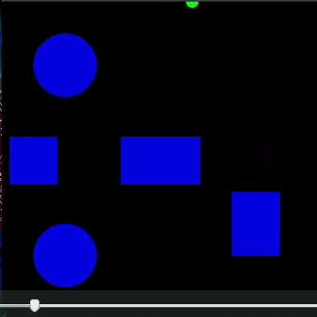

# Sampling-based-Planning-Algorithms
In recent times, sampling-based algorithms have
been employed extensively in a high dimensional space and are
also shown to work well. Besides they are proven to be
probabilistically complete and asymptotically optimal. One
such algorithm that has recently become abundantly popular
in the path planning fraternity is Rapidly-exploring Random
Tree star (RRT*). In this project, we explore RRT*-Quick as
an improved version of RRT*. RRT*-Quick embarks on the
observation that the nodes in a local region have common
parents. It is shown to have a faster convergence rate without
being computationally inefficient by using ancestor nodes to
grow the reservoir of candidate parent nodes.

## RRT(Rapidly-Exploring-Random-Tree)
RRT works by iteratively sampling a random node in the
state space and connecting a new node in that direction from
a random node in our tree. RRT is probabilistically complete
and will almost definitely give you a solution when the
search space becomes dense enough. However, it only finds
us a solution and it might not necessarily be optimal. In fact,
it is rarely optimal.


## RRT*(Rapidly-Exploring-Random-Tree-Star)
RRT* builds on the previous RRT algorithm. Once a new node is connected to the existent tree, RRT* considers
all its neighboring nodes in a volume sphere of a certain
radius around the new node. The radius of the sphere r is
given as:

`r = γ*(log(n)/n)^(1/d)` 

where **γ** is the planning constant, **n** is the number of nodes, **d** is the dimension of the space


## RRT*-Quick(Rapidly-Exploring-Random-Tree-Star-Quick)
The RRT*-Quick class inherits from the RRT and RRT*
classes. The planning function is the main function which is
responsible for driving the algorithm. Initially, a random
node is sampled in the obstacle space and the nearest node is
found. Then, the nearest node is steered towards the random
node. After this, the check collision function is used to
check if the new node lies in the obstacle space or not. This
function implements the half-plane equations on the
obstacle space and returns True if the node is not in obstacle
space and returns false in the other case. After this step the
near nodes are found using the distance metric and their
corresponding ancestors are found. We take the union of
these near nodes and the ancestor nodes and we choose the parent of the new node based on the least distance criteria.
After choosing the parent we rewire the near nodes based on
the ancestor nodes and we append the new node to the node
list.

In the choose parent function we iterate over all the near
nodes and steer each near node towards the new node and
we return assign then node with the least cost as the parent
node of the new node.

In the rewire step we iterate over all near nodes and in each
iteration we iterate over ancestor nodes of the new node and
steer the ancestor nodes to find the least cost path and assign
it to the near node. The important step in rewiring is the
propagation of the costs to the leaves of the new node, this
is a recursive function which helps to update the costs of all
the children nodes.




## Comparison of the three methods
It is evident that as we
increase the number of iterations the RRT*-Quick starts
outperforming the other two algorithms. For 3000 iterations
it has the least cost of 11.66 and if we further increase the
number of iterations or the ancestor hierarchy, it will
improve further. On the other hand RRT* is not far behind
for small iterations it is almost as good as the Quick
algorithm. But RRT is not comparable to these algorithms,
because it has no cost tracking and rewiring.

2000 iterations


3000 iterations


## ROS Gazebo Simulation
This project is simulated in a gazebo world. The world is
shown in figure 5. It is a 10 x 10 grid with polygon
obstacles.ROS provides the capability of creating publishers and
subscribers. We use two ROS nodes to achieve the
simulation. The planner node contain the RRT/RRT*/RRT*
Quick algorithms which writes the shortest path to a text
file. This file is read by the robot_control node to drive the
turtlebot.


### Dependencies
1) rospy
2) rospkg
3) tf
4) geometry_msgs
5) sensor_msgs


### How to run the code
1) The package for running the simulation is named *velocity_publisher*.
2) Please run the below command to launch the turtlebot3 in the gazebo
environment:

```roslaunch velocity_publisher velocity_publisher.launch```

3) After launching the above file, please run the below command to make the
robot go to the goal position:

```rosrun velocity_publisher robot_control```

_____________________________________________________________________________

4) If you want to run the planning algorithm run the following command (It will generate a _shortest_path.txt_ file with the waypoint nodes for the robot
to follow.):


```rosrun velocity_publisher rrt_pygame``` **or** 


```rosrun velocity_publisher rrt_star_pygame``` **or**


```rosrun velocity_publisher rrt_star_quick_pygame```


5) Then you can follow steps 2 and 3 again to simulate that path.
